  # **AKADEMI EDUCATION**
# **Première cohorte (2025): Science des données et intelligence artificielle**
#### *Phase 5: PROJET DE SCIENCE DES DONNÉES*
**Noms des étudiants du groupe: Riché FLEURINORD et Micka LOUIS**   
**Rythme d’apprentissage: Autonome**  
**Date de soutenance: 27 octobre 2025**  
**Noms des instructeurs: Wedter JEROME et Geovany Batista Polo LAGUERRE**  
**Lien de l’article de blog (lien du dépôt GitHub): https://github.com/richefleuriord/Bank_Customer_Churn_Prediction.git**

# Prédiction du Churn Client Bancaire à l’aide du Machine Learning

## 1. Vue d’ensemble du projet
Ce projet de Data Science a pour objectif de prédire le **churn des clients bancaires**, c’est-à-dire identifier les clients susceptibles de quitter la banque.  
L’approche adoptée combine **préparation des données**, **modélisation prédictive**, **évaluation rigoureuse**, **déploiement en temps réel**, et **explicabilité du modèle**, permettant de fournir aux décideurs des insights fiables et actionnables pour la **fidélisation client**.

---

## 2. Compréhension du problème métier

La fidélisation des clients est essentielle pour maintenir la rentabilité et la stabilité d’une institution bancaire.  
Le churn peut entraîner des pertes financières significatives et affecter la réputation de la banque.  
Le projet vise à :

- Identifier les clients à risque de départ.
- Comprendre les facteurs influençant le churn.
- Fournir un outil prédictif utilisable par les équipes marketing et la direction.

---

## 3. Compréhension des données
Le jeu de données contient des informations sur les clients bancaires, incluant :

- Caractéristiques démographiques : âge, genre, pays.
- Données financières : solde, revenu estimé, score de crédit.
- Informations sur les produits détenus et l’activité bancaire.
- Indicateurs de satisfaction et de fidélité.

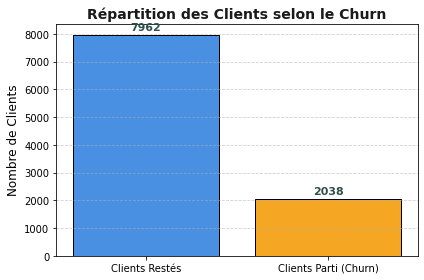

**Préparation des données :**

- Séparation en jeux Train (70%), Validation (15%) et Test (15%).
- Nettoyage, normalisation et encodage.
- Gestion du déséquilibre de classes via SMOTE et pondération selon le modèle.

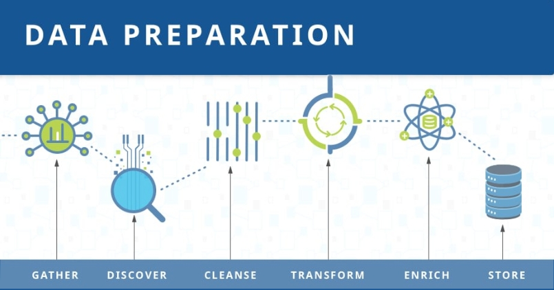

---

## 4. Profiling des clients
Un **profil détaillé des clients** a été établi pour comprendre les comportements :

- Catégories d’âge (Jeune, Moyen, Âgé)
- Nombre de produits détenus
- Activité et engagement dans les opérations bancaires
- Score de satisfaction et points de fidélité

Cette segmentation a permis de mieux interpréter les prédictions et de guider les stratégies de fidélisation.

---

## 5. Analyse exploratoire (EDA)
L’EDA a permis de visualiser et comprendre les relations entre les variables :

- Répartition des clients par âge, genre et pays.
- Corrélations entre solde, revenu, ancienneté et churn.
- Analyse des variables clés : nombre de produits, activité, score de satisfaction.
- Identification des patterns et insights exploitables pour la modélisation.

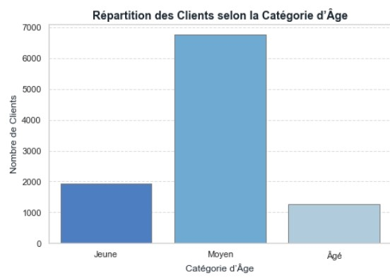

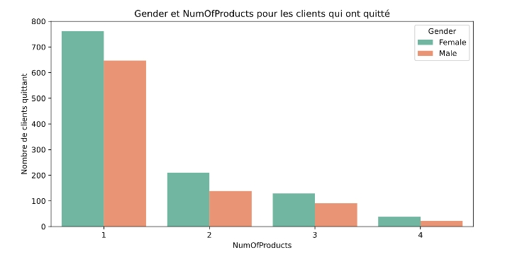

---

## 6. Modélisation
**Algorithmes utilisés :**

- Régression Logistique
- Forêt Aléatoire (Random Forest)
- XGBoost
- Réseau de Neurones (MLP)

**Étapes principales :**

1. Chargement des données préparées.
2. Définition des pipelines (scaling, SMOTE, pondération).
3. Optimisation via GridSearchCV.
4. Évaluation sur le jeu de validation (Accuracy, ROC-AUC, F1-score).
5. Sélection du meilleur modèle (XGBoost retenu).

**Performances clés :**

| Modèle               | ROC-AUC CV  | Accuracy Validation |
|----------------------|------------|------------------|
| Logistic Regression  | 0.7603     | 69.5%            |
| Random Forest        | 0.7892     | 76.3%            |
| XGBoost              | 0.7996     | 72.7%            |
| Neural Network (MLP) | 0.7622     | 79.3%            |

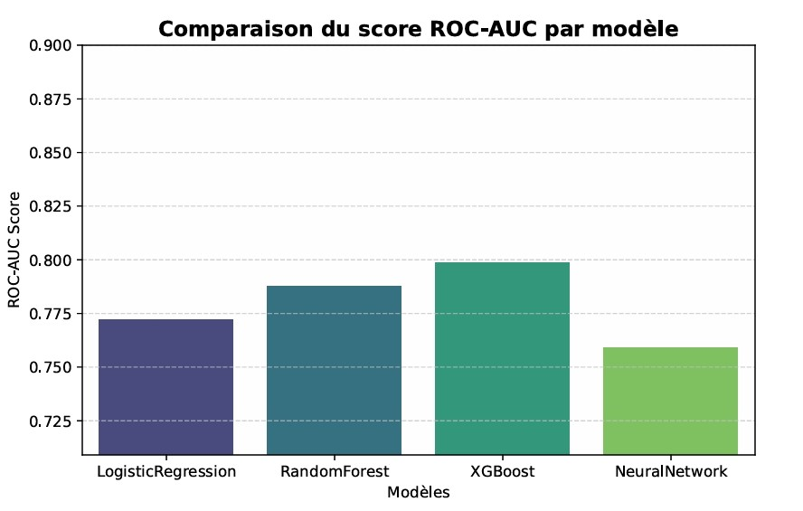

Le **XGBoost** a été sélectionné pour son compromis optimal entre **performance, robustesse et généralisation**.

---

## 7. Évaluation
**Méthodologie :**

- Évaluation sur validation et test.
- Utilisation de métriques adaptées au déséquilibre des classes :  
  Accuracy, Precision, Recall, F1-score, ROC-AUC, Matrice de confusion.

**Résultats :**

- ROC-AUC sur test : 0.878
- Accuracy sur test : 85.6%
- Recall pour la classe minoritaire : 0.45

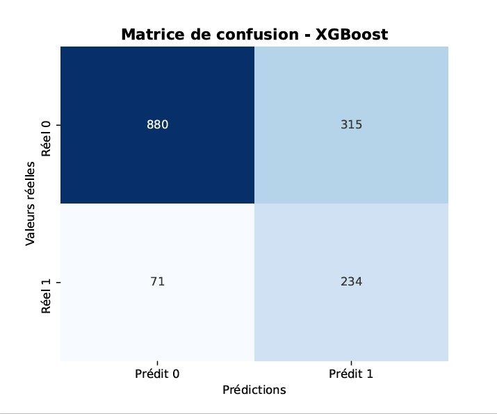

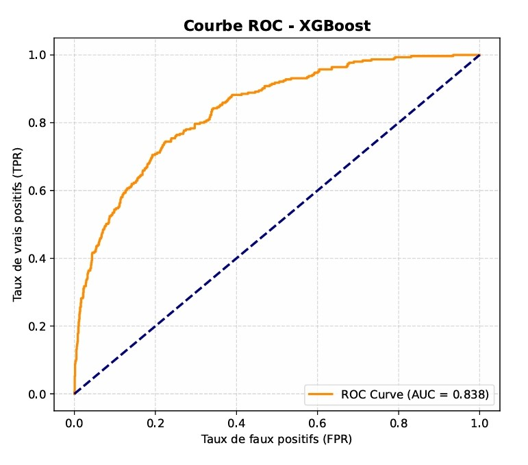

Le modèle XGBoost démontre une **excellente capacité à prédire le churn** tout en maintenant un bon équilibre entre précision et couverture.

---

## 8. Déploiement
Le modèle XGBoost a été intégré dans une **application web interactive Streamlit** permettant :

- Saisie des caractéristiques clients.
- Prédiction instantanée de la probabilité de churn.
- Visualisation intuitive des résultats (% départ / % fidélité).
- Interprétation stratégique pour guider les actions commerciales.

**Fichiers clés :**

- `Best_Model_Deployment.pkl` : pipeline complet (prétraitement + modèle).
- `columns_final.pkl` : colonnes finales utilisées pour l’entraînement.

**Exemple de prédiction :**

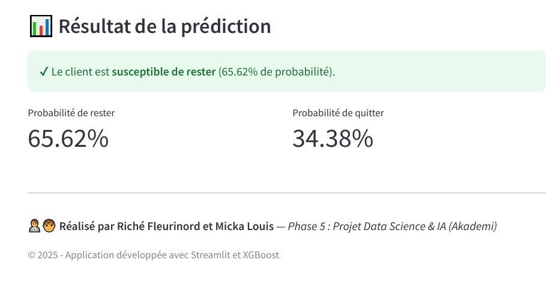

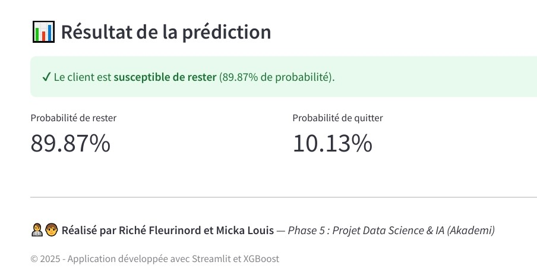

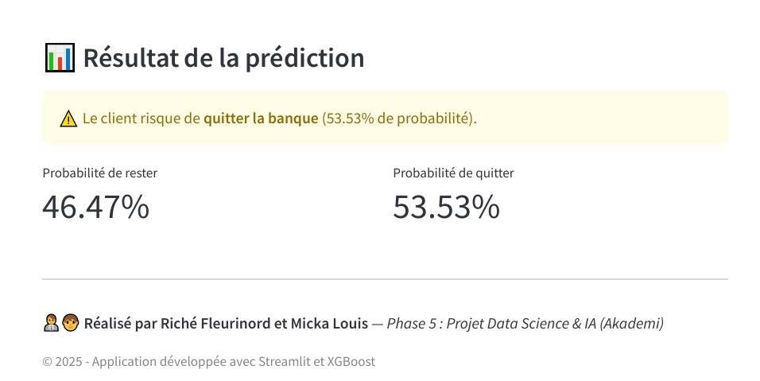

- Client jeune, France, 1 produit, score de satisfaction moyen : risque de départ 34.38%
- Client âgé, Allemagne, 3 produits, score de satisfaction élevé : risque de départ 10.13%
- Cliente moyenne, Espagne, 1 produit, score de satisfaction faible : risque de départ 53.53%

---

## 9. Explicabilité du modèle
**Objectif :** comprendre comment le modèle prend ses décisions pour rendre les prédictions transparentes et actionnables.

**Outils :**

- **SHAP** : explication globale et locale.
- **LIME** : interprétation client par client.
- **Feature Importance** : impact moyen des variables sur le modèle.

**Insights clés :**

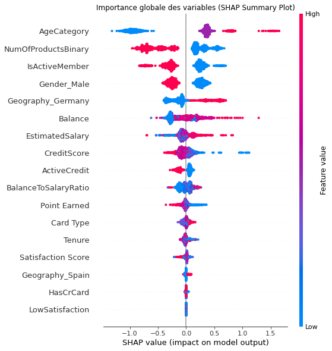

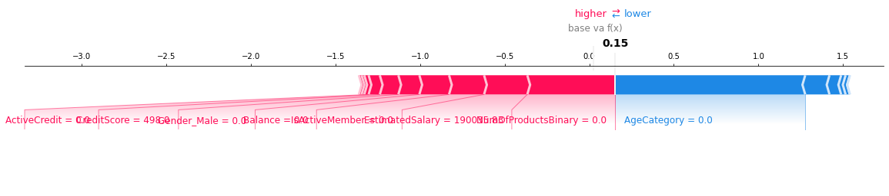

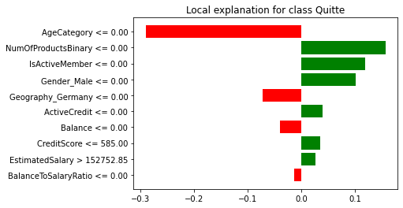

- AgeCategory, NumOfProductsBinary et IsActiveMember sont les facteurs les plus influents.
- Les variables économiques (solde, salaire, BalanceToSalaryRatio) modèrent les prédictions.
- Analyse locale permet de cibler les actions de fidélisation pour chaque client.

---

## 10. Recommandations métiers
1. **Suivi et monitoring** : surveiller les performances du modèle et détecter la dérive des données.
2. **Actualisation des données** : intégrer de nouvelles sources et mettre à jour régulièrement les features.
3. **Optimisation des modèles** : tester XGBoost, LightGBM, réseaux de neurones, ou solutions AutoML.
4. **Automatisation de la fidélisation** : intégration CRM pour campagnes ciblées.
5. **Renforcement de l’explicabilité** : usage continu de SHAP et LIME pour justifier les décisions.
6. **Extension à d’autres domaines** : prédiction de défaut, segmentation dynamique, portefeuille client.

---

## 11. Conclusion
Le projet XGBoost a permis de construire un **modèle prédictif robuste, interprétable et opérationnel**, capable d’anticiper le churn avec fiabilité.  
Grâce à son déploiement via Streamlit, la banque dispose désormais d’un outil pratique pour **optimiser la fidélisation client et la stratégie commerciale**.

---

## 12. Étapes suivantes
- **Monitoring continu** du modèle et détection de la dérive.
- **Mise à jour régulière** des données et des features.
- **Exploration de modèles hybrides et AutoML** pour améliorer la performance.
- **Intégration opérationnelle** dans les systèmes CRM pour actions automatisées.
- **Analyse continue de l’explicabilité** pour renforcer la confiance des équipes.

---
 
Bank_Customer_Churn_Prediction/  
│
├── 📁 Data/ # Contient les données brutes et transformées  
│ ├── Customer-Churn-Records.csv # Jeu de données brut initial  
│ ├── X_train_prepared # Variables explicatives du jeu d'entraînement  
│ ├── X_val_prepared # Variables explicatives du jeu de validation  
│ ├── X_test_prepared # Variables explicatives du jeu de test  
│ ├── y_train_prepared # Variable cible (churn ou non) du jeu d'entraînement  
│ ├── y_val_prepared # Variable cible du jeu de validation  
│ ├── y_test_prepared # Variable cible du jeu de test  
│
├── 📁 les_Notebooks_du_Projet/ # Tous les notebooks Jupyter (profiling, EDA, modélisation, etc.)  
│ ├── 01_Profiling_des_clients.ipynb  
│ ├── 02_EDA.ipynb  
│ ├── 03_Modelisation.ipynb  
│ ├── 04_Evaluation.ipynb  
│ ├── 05_Explicabilite.ipynb  
│ ├── 06_Deploiement.ipynb   
│
├── 📁 Models/ # Sauvegarde des modèles entraînés (.pkl, .joblib)  
│ ├── Best_Model_Deployment.pkl  
│ ├── columns_final.pkl  
│
├── 📁 Outputs/ # Rapports, figures et notebooks exportés en PDF  
│ ├── EDA_Complet.pdf  
│ ├── Evaluation_Report.pdf  
│ ├── Demonstration_deploiement_Streamlit.pdf  
│ ├── Demonstration_deploiement_Streamlit2.pdf  
│ ├── Demonstration_deploiement_Streamlit3.pdf  
│
├── 📁 Streamlit/ # Code de l’application web Streamlit  
│ ├── app.py  
│ ├── config.json  
│
├── 📁 images/ # Graphiques, visuels et bannières pour le README  
│ ├── plot.png   
│ ├── Autres plots   
│
├── 📁 anaconda_projects/db/ # Environnement Anaconda / base locale  
│
├── 📜 Mini_Document_de_Cadrage.pdf # Note de cadrage du projet   
├── 📜 Proposition_de_Projet_Capstone.pdf  
├── 📜 LICENSE # Type de licence (MIT)   
├── 📜 README.md # Documentation principale du projet  
└── 📜 requirements.txt # Liste des dépendances Python à installer  
---

*Analyse réalisée par Riché Fleurinord et Micka Louis — Phase 5 : Projet Data Science & IA (Akademi)*    
© 2025 — Prédiction du Churn Client avec XGBoost   
